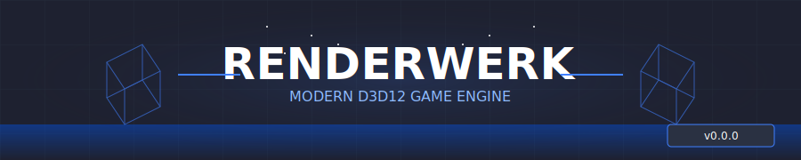
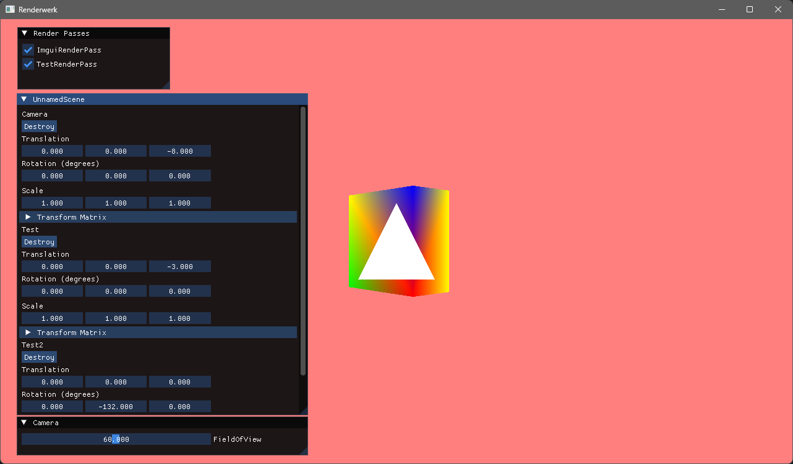
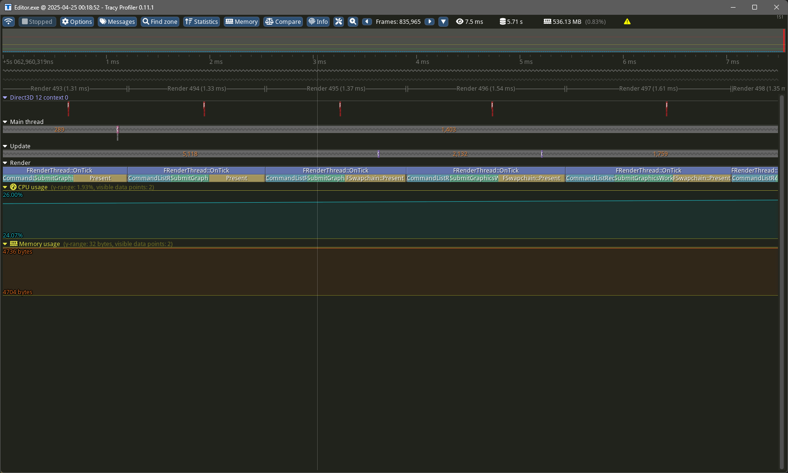

# Renderwerk



## A Modern Game Engine

Renderwerk is a passion project game engine built with DirectX 12 and Vulkan. This C++ engine aims to implement advanced rendering techniques including virtualized geometry via mesh shaders and hardware-accelerated ray tracing for physically-based lighting.

Since this is my hobby project, updates might be a bit slow sometimes as I work on it in my free time. I'm totally open to having other people join in and contribute! If you're into game engines and modern rendering tech, feel free to get involved.

**Current Preview:**

<div align="center" >
	
</div>

## 🔄 Project Status

Renderwerk is under active development. Check the [roadmap](./Documentation/Roadmap.md) for upcoming features.

## 🚀 Getting Started

### Prerequisites

> **❗Note:** _The engine was only tested on Windows 11 using SDK version 10.0.26100.0, but should also run on Windows 10 and older SDK versions_

- Windows 11
- Visual Studio 2022 or Jetbrains Rider
- DirectX 12 and/or Vulkan Compatible GPU
- Latest Windows 11 SDK

### Setting up the project

```bash
# 1. Clone repository
git clone https://github.com/Drischdaan/Renderwerk.git
cd Renderwerk

# 2. Setup workspace
.\Build\Scripts\Setup.ps1

# 3. Generate project files
.\Build\Scripts\GenerateProjectFiles.ps1
```

## 📚 Documentation

Comprehensive documentation can be found in the [Documentation](./Documentation) directory.

### ⌚ Profiling

The engine supports performance profiling through [tracy](https://github.com/wolfpld/tracy), allowing you to identify bottlenecks and optimize your code.

1. Download [tracy v0.11.1](https://github.com/wolfpld/tracy/releases/tag/v0.11.1)
2. Launch the engine application
3. Open the Tracy profiler and connect to your running instance

> **Note:** _More profiler zones are added continuously to improve visibility into engine performance._

<div align="center" >
	
</div>

## 🤝 Contributing

Contributions are welcome! Please read the [contributing guidelines](./Documentation/Contributing.md) before submitting pull requests. I am also actively searching for people that want to help develop Renderwerk. Feel free to contact me.

## 🔗 Dependencies

- [assimp](https://github.com/assimp/assimp)
- [Catch2](https://github.com/catchorg/Catch2)
- [DirectX-Headers](https://github.com/microsoft/DirectX-Headers)
- [DirectXShaderCompiler](https://github.com/microsoft/DirectXShaderCompiler)
- [entt](https://github.com/skypjack/entt)
- [glm](https://github.com/g-truc/glm)
- [imgui](https://github.com/ocornut/imgui)
- [mimalloc](https://github.com/microsoft/mimalloc)
- [spdlog](https://github.com/gabime/spdlog)
- [tracy](https://github.com/wolfpld/tracy)

## 📄 License

Renderwerk is released under the GPL-3.0 License. See [LICENSE](LICENSE) for details.

<div align="center">
  Made with ❤️ by <a href="https://github.com/Drischdaan">Drischdaan</a>
</div>
